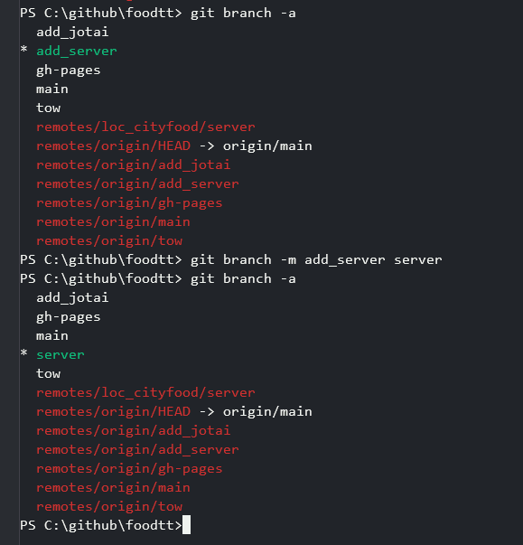
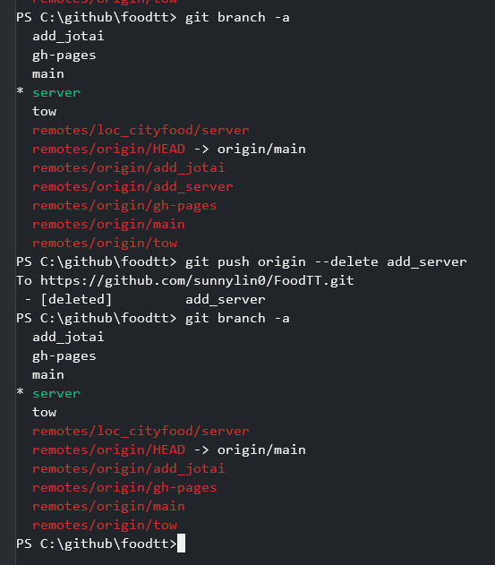
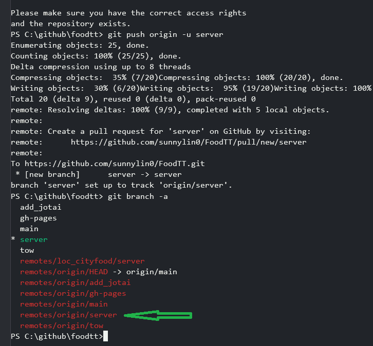

### 移除 .vs 小技巧
    1. 檔案 .gitignore 加入一行 .vs
    2. 進入 dos
    3. 移除 .vs/ 目錄
    4. git rm -r --cached .
    5. git add .
    6. git commit -m 'Remove .vs'
    7. ok 移除 .vs
### 添加遠端數據庫
#### git remote 常見指令
如果你要觀察本地數據庫跟遠端數據庫的關聯，就得仰賴 `git remote` 系列指令

+ 加入遠端數據庫：==git remote add <遠端數據庫簡稱> <url>==
+ 觀看遠端數據庫列表：==git remote==
+ 觀看遠端數據庫列表(包含 rul)：==git remote -v==
+ 下載遠端數據庫：==git clone <url>==

#### 有本地的資料，推 C: 的目錄
    git remote add loc_cityfood c:/github/cityfood/.git
    git remote -v
    git push loc_cityfood server_

#### 推送本地分支到远程仓库
    git push --set-upstream origin 分支名
    git push --set-upstream origin 分支名

#### 修改分支名
    git branch -a
    git branch -m add_server server
    git branch -a_

#### 重命名远程 Git 分支
重命名远程分支不像重命名本地分支那么简单。

准确地说，重命名远程分支不是直接的——你必须删除旧的远程分支名称，然后将新的分支名称推送到 repo。

+ 第 1 步：通过运行 ==git push origin --delete old-branch-name== 删除旧名称
+ 第 2 步：通过运行 ==git push origin -u new-branch-name== 将上游分支重置为新本地分支的名称。
 
        git branch -a
        git push origin --delete add_server
        git branch -a
        git push origin -u server
        git branch -a

